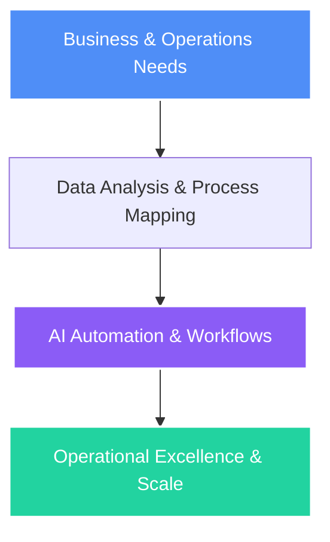

# Hey there, I'm Anurag Tiwary! 👋

<div align="center">
  
</div>

<p align="center">
  <a href="https://anuraggg.tech"></a>
  <a href="https://linkedin.com/in/anurag-tiwary" target="_blank"></a>
  <a href="mailto:off.anuragtiwary@gmail.com"></a>
</p>

---

## ⚡ The Vibe Coder's Terminal

```shell
$ npx execute-profile --user="Anurag Tiwary"
> Location: Noida, Uttar Pradesh, India 📍
> Specialization: Process Planning & System Coordination
> Current: BBA Candidate @ Lloyd Business School
> Latest Intern: Supply Chain Intern @ Welspun Enterprises Ltd
> Status: Shipping digital MVPs and automating operations. ✨
```

---

## 🧠 My Story: Business Operations & AI Automation

I am a **Bachelor of Business Administration (BBA) Candidate (2023–Present)** at **Lloyd Business School**, focusing on **Process Planning & System Coordination**. I bridge the gap between business management and AI integration—engineering prompts, building automation pipelines with **n8n**, and deploying web platforms like **Skope** to streamline workflows and unlock scale.



---

## 💼 Work Experience

### 📦 Supply Chain Intern
**Welspun Enterprises Ltd** | *Jul 2025 – Jul 2025 (1 month)*
* **Department**: Worked in the **Procurement** division under senior leadership.
* **Core Tasks**: Gained hands-on experience in end-to-end procurement processes, vendor coordination, and transactional operations inside **SAP MM**.
* **Impact**: Contributed to data analysis, supplier evaluation, and cost optimization initiatives to maintain smooth supply chain workflows.
* **Skills**: Refined organizational compliance, supplier auditing, and detailed process documentation.

### 📈 Founder & Brand Owner
**Founder’s Feed** | *Aug 2024 – Nov 2024 (2 months)*
* **Core Tasks**: Launched and scaled a digital content brand tailored for startup founders and young entrepreneurs.
* **Outreach**: Cultivated an organic audience of **400+ followers on Instagram** and **200+ followers on LinkedIn** within 90 days.
* **Content Engine**: Designed weekly content calendars, utilizing **Canva AI** and engagement analytics to boost reach by **40%** and maintain a **25%+ engagement rate**.

### 🤝 Fundraising Intern
**Tare Zameen Foundation** | *Oct 2023 – Nov 2023 (2 months)*
* **Core Tasks**: Aided social impact campaigns supporting **300+ underserved students**.
* **Impact**: Managed donor relations, created outreach marketing assets, and raised **₹15,000+** in micro-donations.

---

## 🏫 Education

* **Lloyd Business School** (2023 – Present)  
  *Bachelor of Business Administration (BBA)*  
  *Focus*: Process Planning, System Coordination. Participated in live business process improvement case studies.
* **Apeejay Public School** (2021 – 2023)  
  *High School Commerce*: Studied financial accounting, marketing, and business management fundamentals.

---

## 🛠️ Skills & Certifications

<table>
  <tr>
    <td valign="top" width="50%">
      <h3>🤖 AI & Digital Tools</h3>
      
      
      
      
    </td>
    <td valign="top" width="50%">
      <h3>📊 Business & Tech Core</h3>
      
      
      
      
    </td>
  </tr>
  <tr>
    <td valign="top" width="50%">
      <h3>📢 Content & Outreach</h3>
      <ul>
        <li>Social Media Marketing</li>
        <li>Content Planning & Calendars</li>
        <li>Brand Storytelling</li>
        <li>Donor Engagement</li>
      </ul>
    </td>
    <td valign="top" width="50%">
      <h3>👥 Soft Skills</h3>
      <ul>
        <li>Public Speaking</li>
        <li>Project Coordination</li>
        <li>Stakeholder Communication</li>
        <li>Vendor Alignment</li>
      </ul>
    </td>
  </tr>
</table>

### 🏅 Certifications
* **Connected Leadership** – Yale University
* **LinkedIn Marketing Solutions Fundamentals** – LinkedIn Learning
* **Building Your Power Brand** – Udemy
* **Canva: Web and Digital Design** – Canva Training

---

## 🚀 Projects & Achievements

* **Skope Platform (Founder)**: Built a conversational career diagnostic portal for Class 12 students in India, utilizing React, Node.js, Express, and the Gemini API to construct personalized career matching.
* **Excel Road Accident Dashboard**: Constructed a data visualization dashboard on traffic accidents using pivot tables, custom charts, and slicers.
* **Shri Ram Trading Challenge (2024)**: Simulated strategic portfolio management and stock trading.
* **Inbox Impression Competition (2024)**: Winner of the campaign strategy challenge.
* **IIT Delhi SPARC Workshop**: Participated in a specialized academic workshop on *"Emerging ICT: Blockchain and its Implications"*.

---

## 📊 GitHub Analytics

<p align="center">
  
  
</p>

<br/>

<div align="center">
  
</div>

---

<div align="center">
  <sub>Built with 💜 and AI by Anurag Tiwary</sub>
</div>
